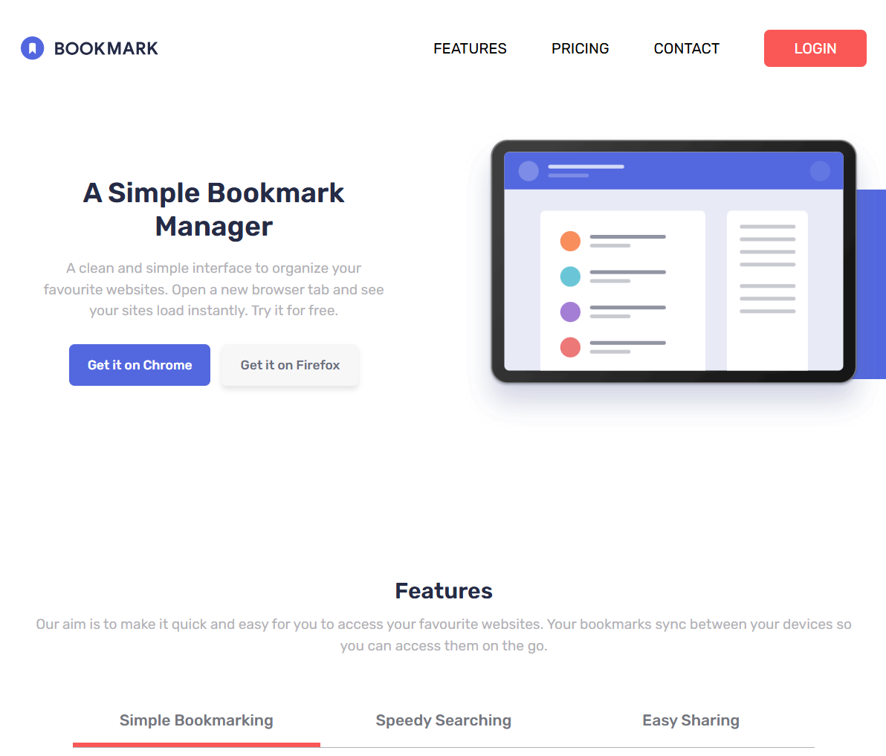

# Frontend Mentor - Bookmark landing page solution

This is a solution to the [Bookmark landing page challenge on Frontend Mentor](https://www.frontendmentor.io/challenges/bookmark-landing-page-5d0b588a9edda32581d29158). Frontend Mentor challenges help you improve your coding skills by building realistic projects.

## Table of contents

- [Overview](#overview)
  - [The challenge](#the-challenge)
  - [Screenshot](#screenshot)
  - [Links](#links)
- [My process](#my-process)
  - [Built with](#built-with)
  - [What I learned](#what-i-learned)
  - [Useful resources](#useful-resources)
- [Author](#author)

## Overview

### The challenge

Users should be able to:

- View the optimal layout for the site depending on their device's screen size
- See hover states for all interactive elements on the page
- Receive an error message when the newsletter form is submitted if:
  - The input field is empty
  - The email address is not formatted correctly

### Screenshot



### Links

- Solution URL: [Add solution URL here](https://github.com/denissoboslai13/frontend-mentor-bookmark)
- Live Site URL: [Add live site URL here](https://denissoboslai13.github.io/frontend-mentor-bookmark/)

## My process

### Built with

- Semantic HTML5 markup
- CSS custom properties
- Flexbox
- CSS Grid
- Mobile-first workflow
- [React](https://reactjs.org/)
- [Tailwind](https://tailwindcss.com/)
- [Motion](https://motion.dev/)

**Note: These are just examples. Delete this note and replace the list above with your own choices**

### What I learned

Pretty nice challenge, i mainly only learned how to properly work with svgs:

```js
<circle class='logo-circle' fill="#5267DF" cx="12.5" cy="12.5" r="12.5"/><path class='logo-bookmark' d="M9 9v10l3.54-3.44L16.078 19V9a2 2 0 0 0-2-2H11a2 2 0 0 0-2 2z" fill="#FFF"/>
```

```js
<Logo className="[&_.logo-text]:fill-white [&_.logo-circle]:fill-white [&_.logo-bookmark]:fill-[#252b46]/90" />
```

### Useful resources

- [Tailwind shadow generator](https://folge.me/tools/tailwind-shadow-generator) - Always helpful for getting shadows done in tailwind.

## Author

- Frontend Mentor - [@denissoboslai13](https://www.frontendmentor.io/profile/denissoboslai13)
